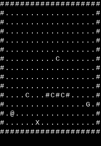
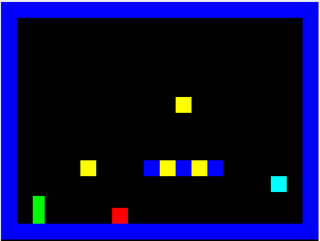

<h1>PlatE Game Engine</h1>

## Project state:

<a href="https://www.youtube.com/watch?v=JVbw02MKlgA"> Last update: May 04, 2023</a>
 

🔧 🚧🚧🚧 In development 🚧🚧🚧 👷

PlatE is a game engine for creating platformer games.

Disclaimer: PlatE was created on Linux (Ubuntu) and is expected to be used on a Linux distro (ideally a Debian based distro), and is not expected to work on other OS by default.

	<h2>Creating Levels</h2>
	
To create a level for PlatE, create a text file with the level design. The level should be a grid of characters, where each character represents a different object in the game. The following objects are currently supported:

	<ul>
		<li>"@": Player</li>
		<li>"#": Solid block</li>
		<li>"_": Platform (with no bottom collision)</li>
		<li>".": Empty</li>
		<li>"C": Coin</li>
		<li>"G": Goal</li>
		<li>"X": Spike</li>
	</ul>
	
The text file should have a fixed width and height of 20 by 15 characters. You can create a copy of the level_template.lvl file to help you create new levels.

	 

	  
	  
	

	<h2>Compiling and Using PlatE</h2>
	
To compile PlatE, run the following command:

	<pre>gcc PlatE.c -o PlatE -lSDL2</pre>
	
To make sure PlatE can be executed run the following command:

	<pre>chmod +x ./PlatE</pre>
	
To use PlatE, run the following command:

	<pre>./PlatE level_name.lvl</pre>
	
In this example <code>level_name.lvl</code> file would be the name of the text file containing the level design.

	<h2>How it Works</h2>
	
PlatE is written in C and uses the SDL2 graphics library for rendering graphics. The current version of PlatE includes the following features:

	<ul>
            <li>Level creation from a text file</li>
	    <li>Basic collision detection and gravity</li>
	    <li>Player movement and jumping</li>
	    <li>Objects with customizable color and solidness</li>
	    <li>A maximum of 300 objects allowed in the game</li>
	    <li>A game over and win game function</li>
	</ul>
	
PlatE is still under development, and additional features are planned for future versions:

	<ul>
		<li>Viewport</li>
		<li>Sound</li>
		<li>Adaptive level size based on the .lvl file</li>
		<li>Multiple levels</li>
		<li>Main menu</li>
		<li>Level editor</li>
		<li>Moving enemies</li>
		<li>Moving platforms</li>
		<li>Power-ups</li>
		<li>GUI with score</li>
	</ul>

